# 🧑‍💻 Online Judge Platform

An advanced **Online Judge System** built using **React (frontend)**, **Node.js (code judge backend)**, and **Spring Boot (core backend)** — enabling users to create, submit, and evaluate coding problems across multiple programming languages.

---

## 🚀 Features

- 🔐 **Authentication & Authorization**
- 🧮 **Problem Creation and Tagging**
- 💻 **Code Submission & Real-time Evaluation**
- ⚙️ **Judging Engine** with support for:
  - ✅ Accepted (AC)
  - ❌ Wrong Answer (WA)
  - ⏱️ Time Limit Exceeded (TLE)
  - 💾 Memory Limit Exceeded (MLE)
  - 🧩 Compilation / Runtime Errors
- 📊 **Dashboard** for statistics and submissions
- 📚 **Search & Filter Problems**
- 🧠 **Code Editor** with syntax highlighting
- 🧾 **View Submission Results**

---

## 🧩 Tech Stack

| Layer | Technology |
|-------|-------------|
| **Frontend** | React.js, React Bootstrap, Material-UI |
| **Backend (Core)** | Spring Boot (Java), REST API |
| **Backend (Judge)** | Node.js, Express.js |
| **Database** | MySQL |
| **Other Tools** | Docker, JWT, Axios, React-Quill, React-Google-Charts |

---

## 🧰 Prerequisites

Make sure you have the following installed:

- Node.js  
- Docker Desktop  
- Java 11+  
- Maven  

---

## ⚙️ Environment Configuration

### 1. `judge/config/config.js`
```js
PORT = 5000
JWT_PRIVATE_KEY = <your_secret_key>
BACK_SERVER_URL = "http://localhost:8080"
```

### 2. client/src/config/config.js
```js
export const BACK_SERVER_URL = "http://localhost:8080";
export const JUDGE_URL = "http://localhost:5000";
```

## 🖥️ Setup Instructions (Without Docker Compose)

### Step 1: Clone Repository
```bash
git clone https://github.com/<your-username>/diya-burman-online-judge.git
cd diya-burman-online-judge
```

### Step 2: Start the Spring Boot Server
```bash
cd server
./mvnw spring-boot:run
```
Server runs on 👉 http://localhost:8080

### Step 3: Start the Judge Server
```bash
cd judge
npm install
mkdir submissions
npm start
```
Judge runs on 👉 http://localhost:5000
🧩 Note: The Judge server uses Docker internally to compile and execute code securely.
Make sure Docker Desktop is running before this step.

### Step 4: Start the React Client
```bash
cd client
npm install
npm start
```
Frontend runs on 👉 http://localhost:3000


## Snapshots
### SignIn
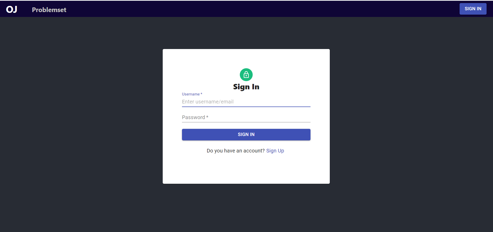
### SignUp
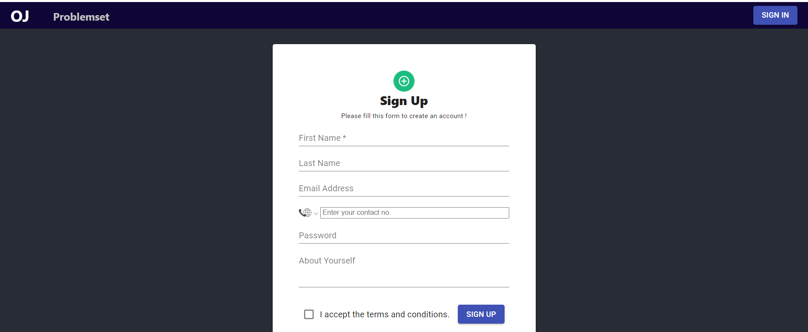
### ProblemSet
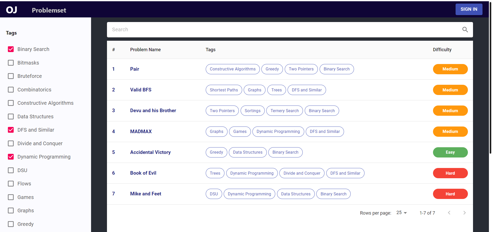
### Problem Page
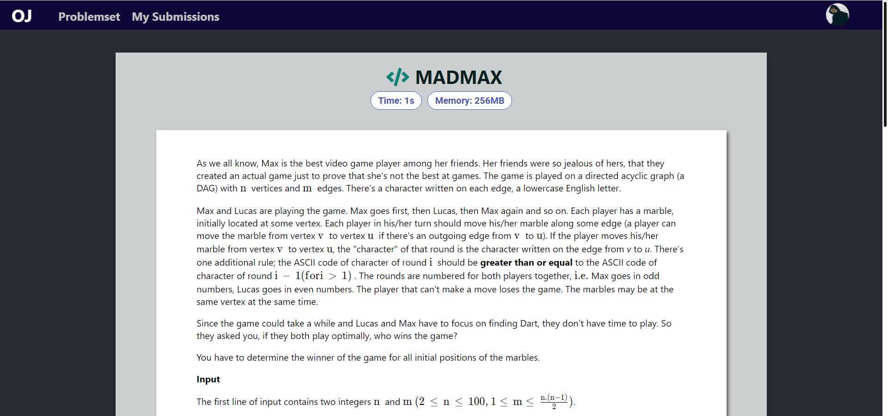
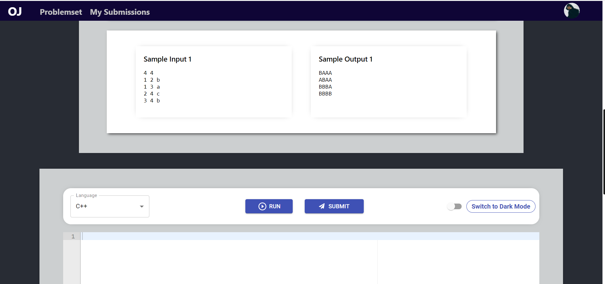
### Code Editor
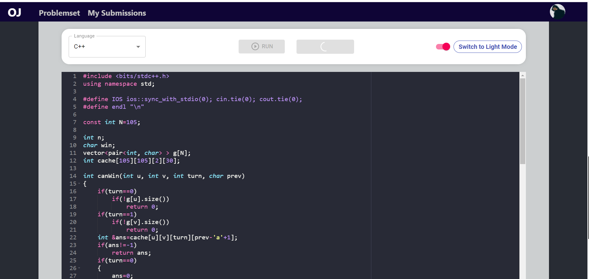
### Results
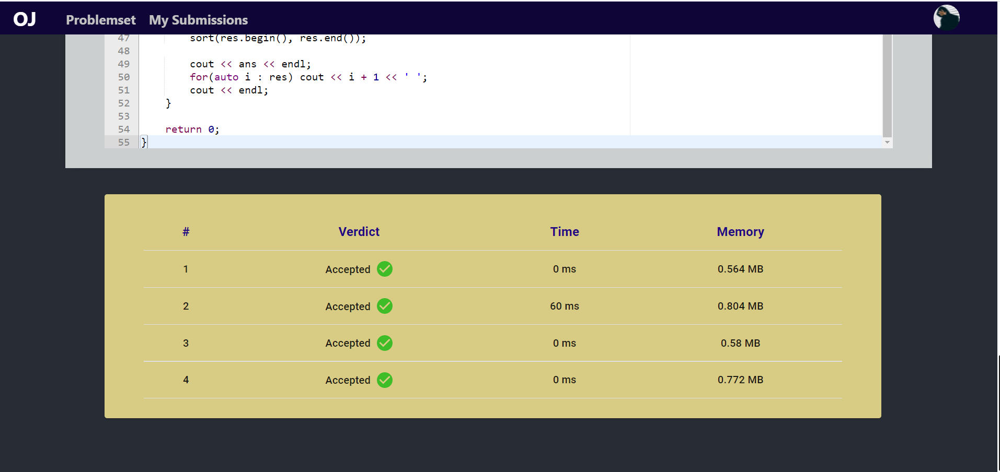
### Add Problem Page
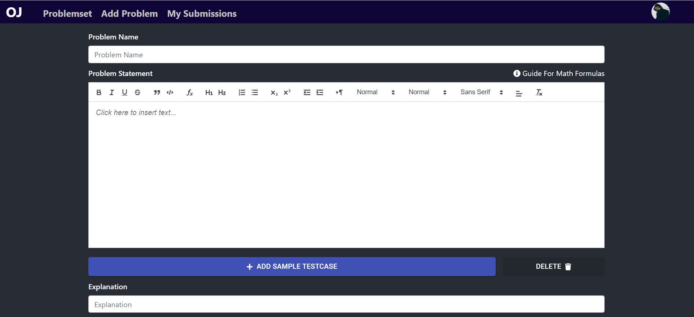
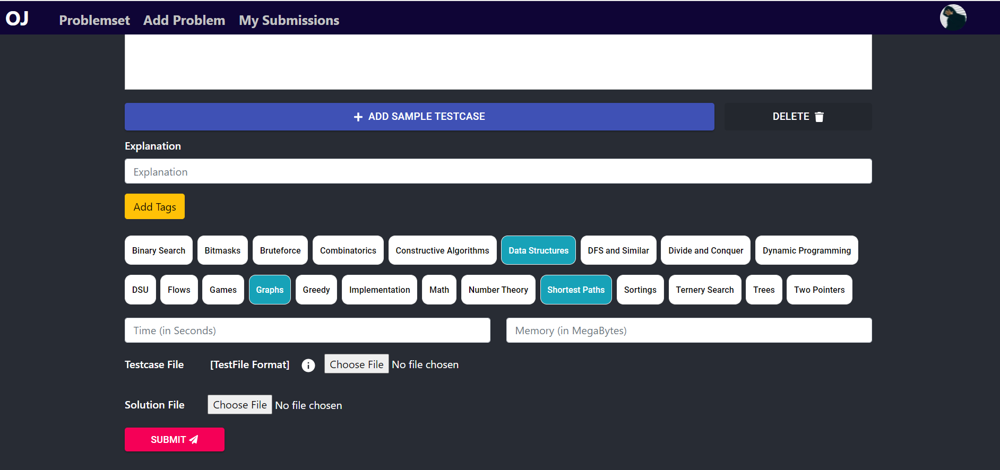
### User Submissions
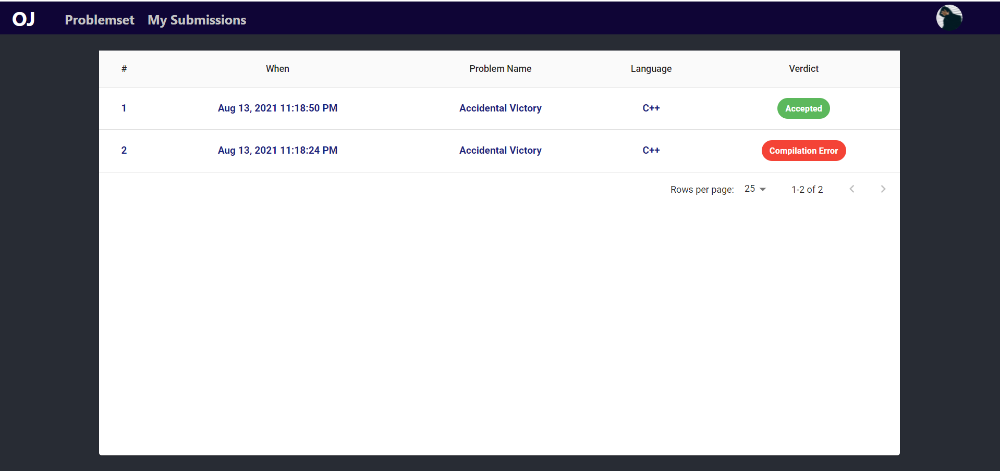
### User Submission Modal
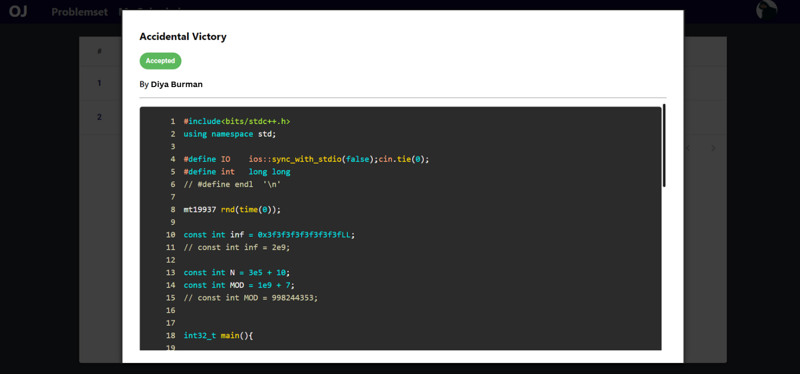

